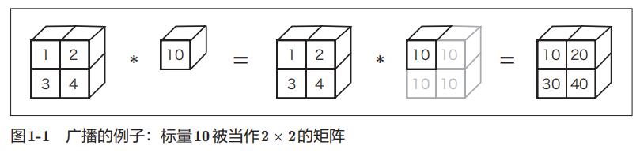
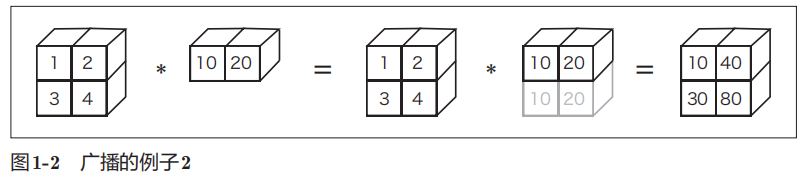

# NumPy

NumPy数组（np.array）可以生成N维数组

- 单个数字成为标量（Scalar）
- 数学上将一维数组称为向量(vector)
- 将二维数组称为矩阵(matrix)
- 三维数组及三维以上的数组称为 **张量(tensor)** 或“多维数组”

## 广播

NumPy中，形状不同的数组之间也可以进行运算

比如：标量10被扩展成了2 × 2的形状，然后再与矩阵A进行乘法运算。
这个巧妙的功能称为广播（broadcast）

```python
import numpy as np

A = np.array([[1, 2], [3, 4]])

"""
array([[ 10, 20],
 [ 30, 40]])
"""
A * 10
```



一维数组B被“巧妙地”变成了和二位数组A相同的形状，然后再以对应元素的方式进行运算

```python
import numpy as np

A = np.array([[1, 2], [3, 4]])
B = np.array([10, 20])

"""
array([[ 10, 40],
 [ 30, 80]])
"""
A * B
```



