# 感知机

感知机也是作为神经网络（深度学习）的起源的算法

**感知机接收多个输入信号，输出一个信号。**

感知机的信号只有“流/不流”（1/0）两种取值。通常 0 对应“不传递信号”，1 对应“传递信号”。

比如：接收两个输入信号的感知机

- x1、x2是输入信号
- y是输出信号
- w1、w2是权重（w是weight的首字母）
- 图中的**○称为“神经元”或者“节点”**

输入信号被送往神经元时，会被分别乘以固定的权重（w1 * x1、w2 * x2）
神经元会计算传送过来的信号的总和，只有**当这个总和超过了某个界限值时，才会输出1**。这也称为“**神经元被激活**”。
这里将这个界限值称为**阈值，用符号θ表示**

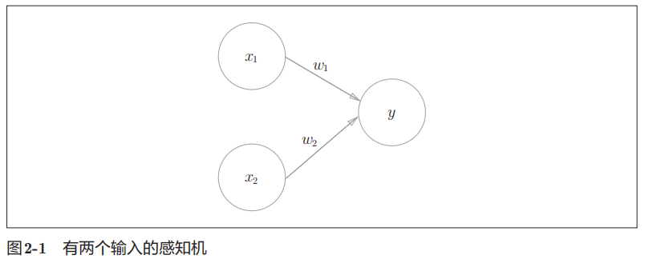

用数学表示，感知机可以表示为：

导入权重和偏置的感知机公式：

- 权重
    - w1和w2是控制输入信号的重要性的参数
- 偏置
    - 是调整神经元被激活的容易程度（输出信号为1的程度）的参数

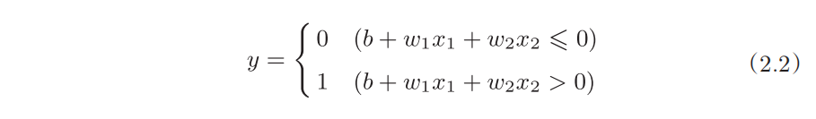

感知机的多个输入信号都有各自固有的权重，这些权重发挥着控制各个信号的重要性的作用。
也就是说，权重越大，对应该权重的信号的重要性就越高。

# 简单逻电路

## 1.与门

与门**仅在两个输入均为1时输出1**，其他时候则输出0
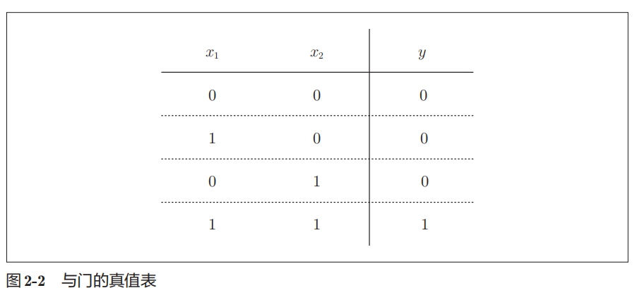

下面考虑用感知机来表示这个与门。实际上，满足条件的参数的选择方法有无数多个。

比如，当(w1, w2, θ) = (0.5, 0.5, 0.7)，
此外，当 (w1, w2, θ)为(0.5, 0.5, 0.8)或者(1.0, 1.0, 1.0)时，同样也满足与门的条件

## 2.与非门

与非就是 **颠倒了与门的输出**，仅在两个输入均为1时输出0，其他时候则输出1

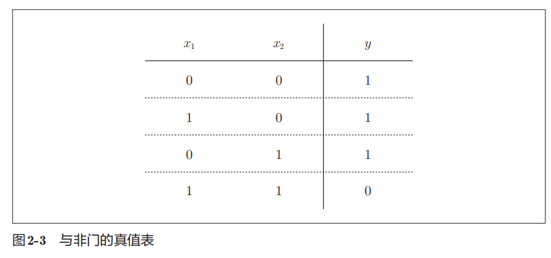

要表示与非门，可以用(w1, w2, θ) = (−0.5, −0.5, −0.7)这样的组合（其他的组合也是无限存在的）。

## 3.或门

“只要有一个输入信号是1，输出就为1”的逻辑电路

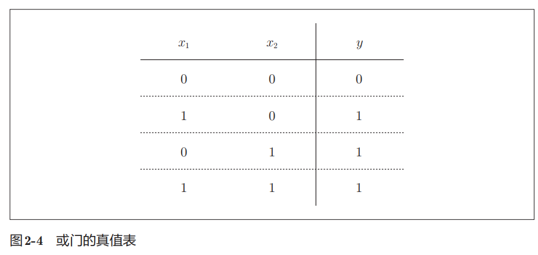

这里决定感知机参数的并不是计算机，而是我们人。我们看着真值表这种“训练数据”，人工考虑（想到）了参数的值。

**而机器学习的课题就是将这个决定参数值的工作交由计算机自动进行**。

学习是确定合适的参数的过程，而人要做的是思考感知机的构造（模型），并把训练数据交给计算机

# 感知机的局限

## 异或门

仅当x1或x2中的一方为1时，才会输出1
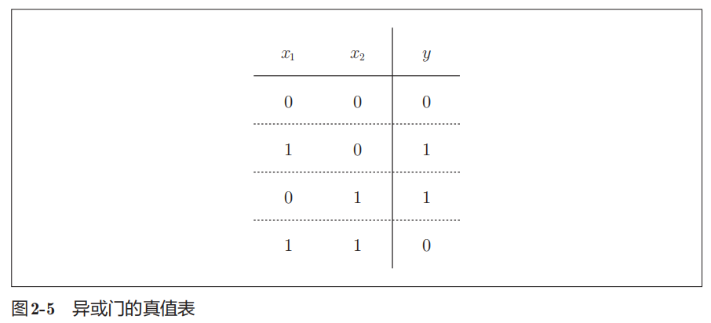

实际上，用前面介绍的感知机是无法实现这个异或门。**为什么用感知机可以实现与门、或门，却无法实现异或门呢？**

首先，我们试着将或门的动作形象化。
或门的情况下，当权重参数(b, w1, w2) = (−0.5, 1.0, 1.0)时，满足真值表条件

此时，感知机可用下面的公式表示：
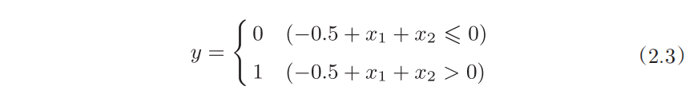

该公式表示的感知机会生成由直线−0.5 + x1 + x2 =
0分割开的两个空间。其中一个空间输出1，另一个空间输出0

- 或门在(x1, x2) = (0, 0)时输出0
- 在(x1, x2)为(0, 1)、(1, 0)、(1, 1)时输出1
- ○表示0，△表示1

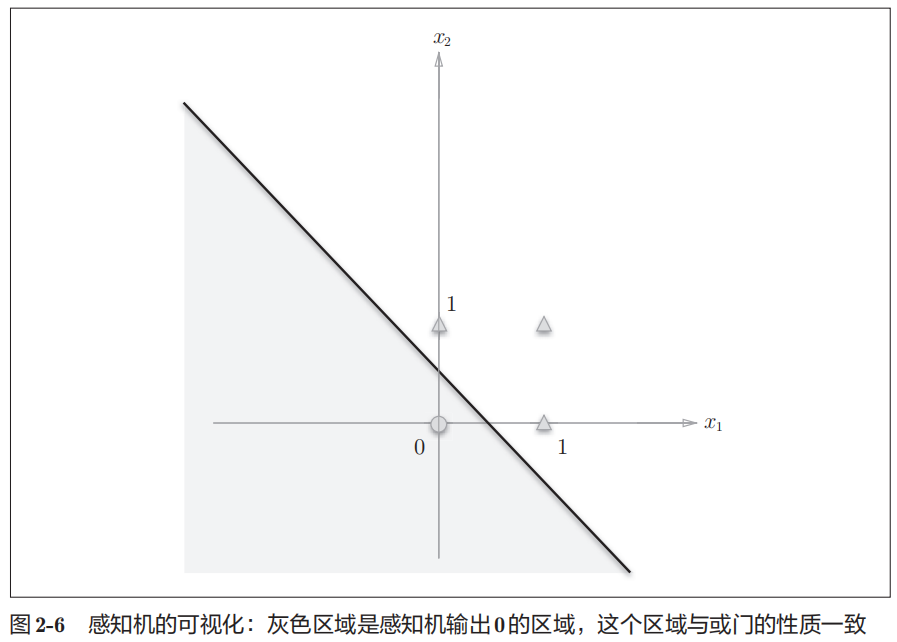

异或真值表在坐标轴上绘制：
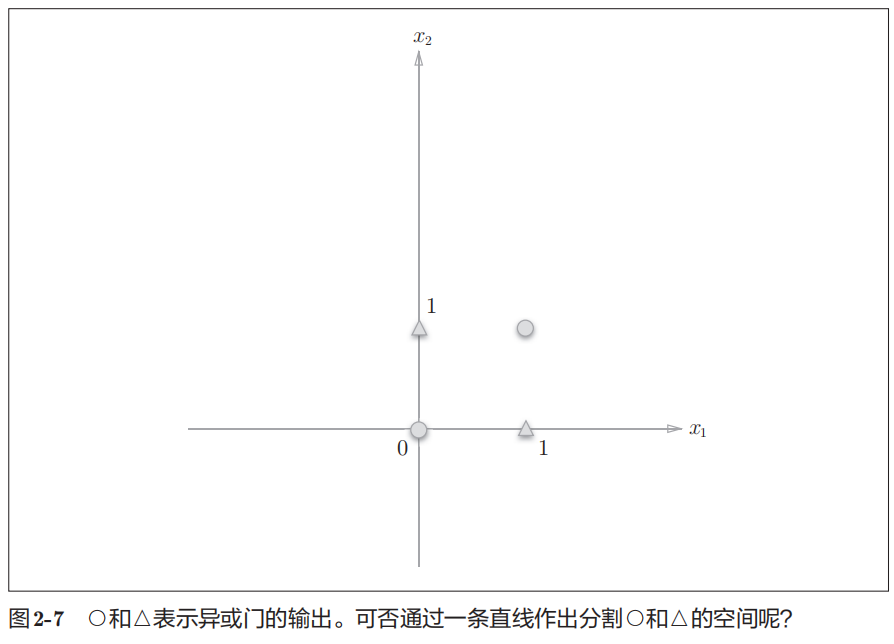

如果想要用一条直线将图中的 ○和△分开，无论如何都做不到。事实上，用一条直线是无法将○和△分开的。
但是如果将“直线”这个限制条件去掉，就可以实现了

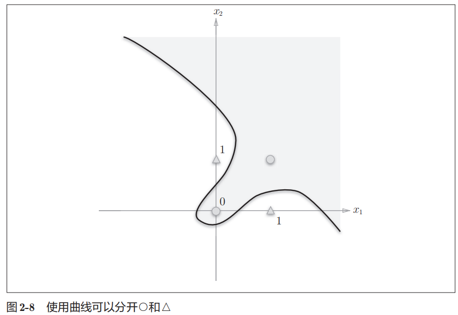

单层感知机无法表示异或门，也即“单层感知机无法分离非线性空间”

## 线性和非线性

- 线性空间
    - 由直线分割而成的空间称为线性空间

- 非线性空间
    - 由曲线分割而成的空间称为非线性空间

# 多层感知机

**感知机的局限性**就在于它只能表示由一条直线分割的空间，但是感知机的绝妙之处在于它可以“叠加层”

换个角度，使用已有门电路进行组合，其中之一就是组合我们前面做好的与门、与非门、或门进行配置

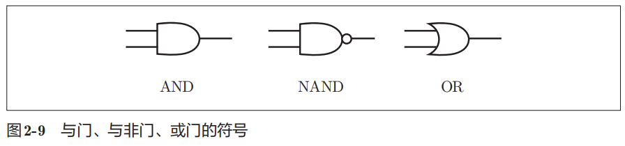

如下：

- x1和x2表示输入信号
- x1和x2是**与非门**和**或门**的输入，而与非门和或门的输出则是**与门**的输入
- y表示输出信号

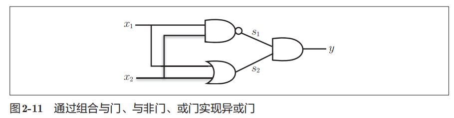

组合电路真值表如下：

- s1作为与非门的输出
- s2作为或门的输出

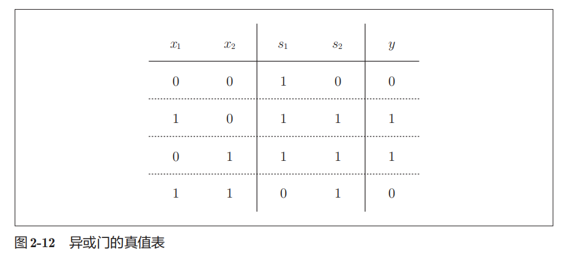

下面我们试着用感知机的表示方法（明确地显示神经元）来表示这个异或门，

- 将最左边的一列称为第0层
- 中间的一列称为第1层
- 最右边的一列称为第2层

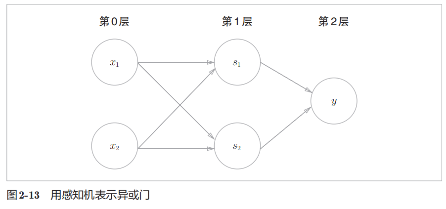

说明：

- 以上感知机与前面介绍的与门、或门的感知机形状不同。实际上，与门、或门是单层感知机，而异或门是2层感知机。叠加了多层的感知机也称为多层感知机（multi-layered
  perceptron）
- 以上感知机总共由 3 层构成，但是因为拥有权重的层实质上只有 2层（第 0层和第 1层之间，第 1层和第 2层之间），所以称为“2层感知机”
- 不过，有的文献认为感知机是由 3 层构成的，因而将其称为“3层感知机”

# 从与非门到计算机

多层感知机可以实现比之前见到的电路更复杂的电路。
比如，进行加法运算的加法器也可以用感知机实现。

此外，将二进制转换为十进制的编码器、满足某些条件就输出1的电路（用于等价检验的电路）等也可以用感知机表示。
