# 神经网络

神经网络的一个重要性质是它可以自动地从数据中学习到合适的权重参数。

用图来表示神经网络（ **二层网络三层神经元**）的话，

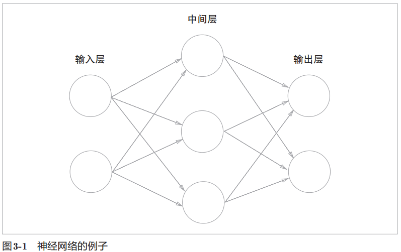

- 我们把最左边的一列称为输入层
- 最右边的一列称为输出层
- 中间的一列称为中间层, 中间层有时也称为隐藏层

我们把输入层到输出层依次称为第0层、第1层、第2层（层号之所以从0开始，是为了方便基于Python进行实现）

---

# 激活函数

导入权重和偏置的感知机如下：
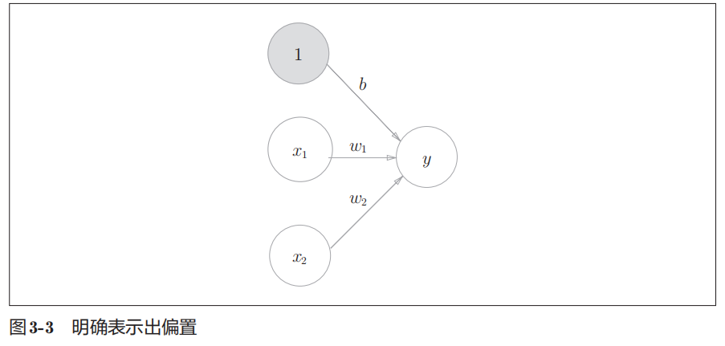

为了简化函数，我们用一个函数来表示这种分情况的动作（超过0则输出1，否则输出0） 引入新函数h (x)

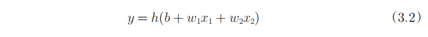

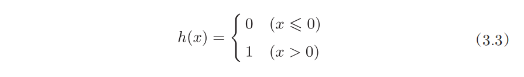

现在来进一步改写式， 分 **两个阶段进行处理，先计算输入信号的加权总和，然后用激活函数转换这一总和**

- 计算加权输入信号和偏置的总和，记为a
- 用h ()函数将 a 转换为输出 y

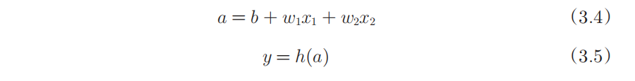

之前的神经元都是用一个○表示的，如果要在图中明确表示公式，则可以如下：

- 信号的加权总和为节点a
- 然后节点a被激活函数h ()转换成节点y

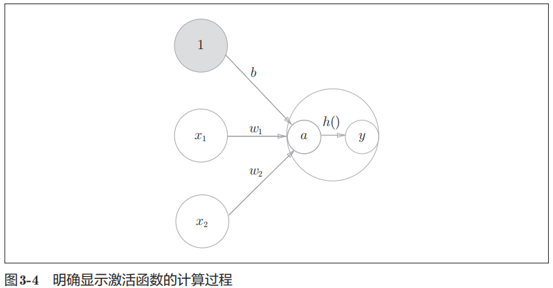

将输入信号的总和转换为输出信号，这种函数一般称为激活函数（activation function） 激活函数的作用在于决定如何来激活输入信号的总和。

**感知机拓展：**

- “朴素感知机”是指单层网络，指的是激活函数使用了【阶跃函数】的模型。
- “多层感知机”是指神经网络，即使用 【sigmoid函数】等平滑的激活函数的多层网络 (S型曲线)

## 阶跃函数

当输入大于0时，输出1，否则输出0

图像：
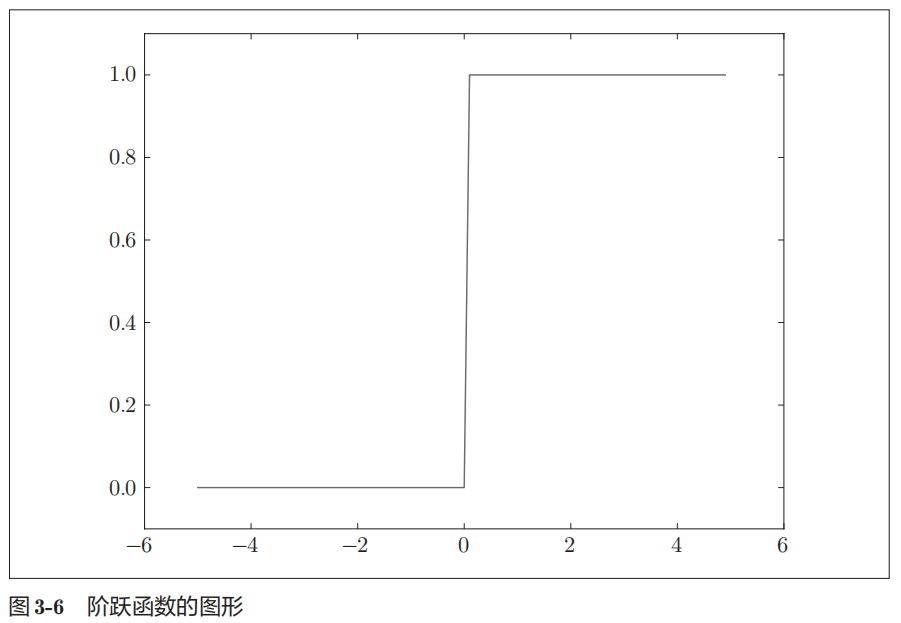

## sigmoid 函数

公式：
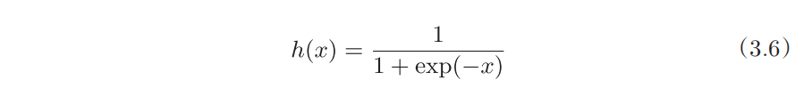
其中 的exp (−x)表示e^−x。e是纳皮尔常数2.718

图像:
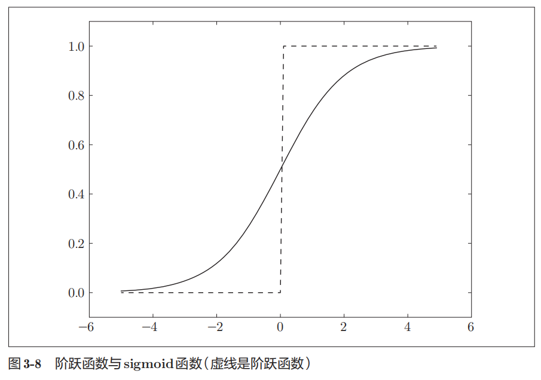

比较一下sigmoid 函数和阶跃函数

- “平滑性”不同，但具有相似的形状（输入小时，输出接近0（为0）；随着输入增大，输出向1靠近（变成1））
- 相对于阶跃函数只能返回 0 或 1，sigmoid函数可以返回 0 ~ 1 之间的任意实数

## 非线性函数

阶跃函数和sigmoid函数还有其他共同点，就是两者均为非线性函数（由曲线分隔）

神经网络的激活函数必须使用非线性函数。

<span style="color:red">**线性函数的问题在于，不管如何加深层数，总是存在与之等效的“无隐藏层的神经网络”。**</span>

示例说明：

- 这里我们考虑把线性函数 h (x) = cx 作为激活函数
- 把y (x) = h (h (h (x)))的运算对应3层神经网络A

这个运算会进行y (x) = c × c × c × x的乘法运算，但是同样地处理可以由y (x) = ax（注意，a = c^3）这一次乘法运算（即没有隐藏层的神经网络）来表示。
如示例所示，使用线性函数时，无法发挥多层网络带来的优势。因此，为了发挥叠加层所带来的优势，激活函数必须使用非线性函数

## ReLU函数

ReLU函数（Rectified Linear Unit） 在输入大于0时，直接输出该值；在输入小于等于0时，输出0

公式：
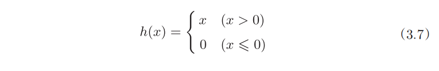

图像：
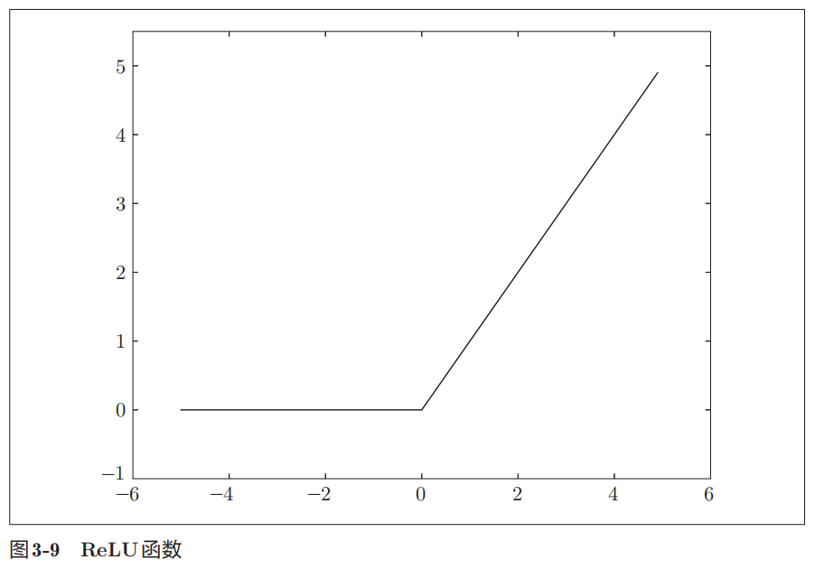

---

# 神经网络内积

我们使用NumPy矩阵来实现神经网络。此处这个神经网络省略了偏置和激活函数，只有权重。
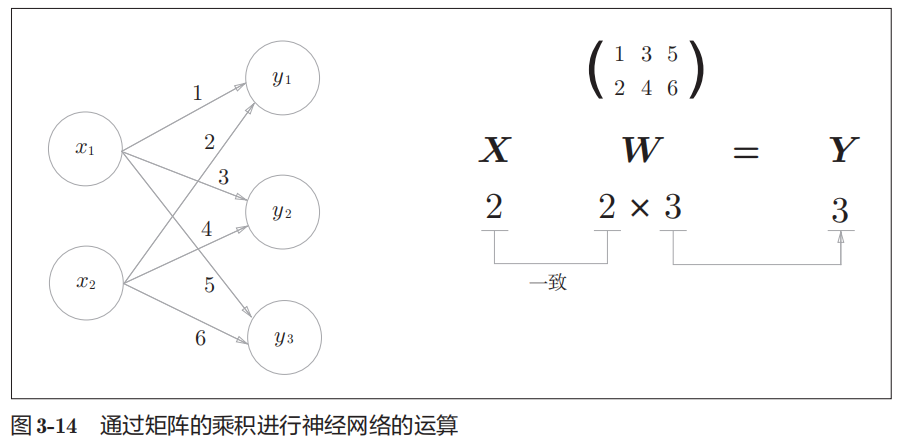

```python
import numpy as np

# 输入
X = np.array([1, 2])
# X.shape (2,)

# 定义权重矩阵
W = np.array([[1, 3, 5], [2, 4, 6]])
# W.shape (2, 3)

Y = np.dot(X, W)
# Y.shape (3,)
```

---

# 三层神经网络实现

我们以3层神经网络为对象，实现从输入到输出的（前向）处理

- 输入层（第0层）有2个神经元
- 第1个隐藏层（第1层）有3个神经元
- 第2个隐藏层（第2层）有2个神经元
- 输出层（第3层）有2个神经元

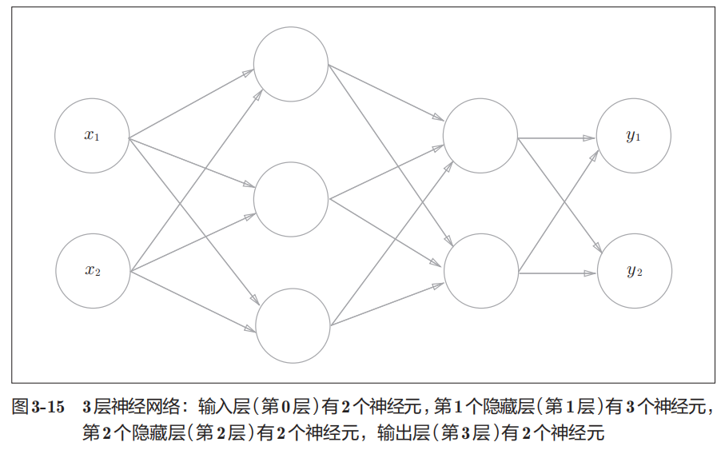

## 符号定义

下图突出显示了从输入层神经元x2 到后一层的神经元a1 (1)的权重

- 权重和隐藏层的神经元的右上角有一个“ (1)”，它表示 权重和神经元的层号（即第1层的权重、第1层的神经元）
- 权重的右下角有两个数字，它们是后一层的神经元和前一层的神经元的索引号
    - 比如，w12 (1) 表示前一层的 第2个神经元 x2 到后一层的第1个神经元a1 (1)的权重
- 权重右下角按照“后一层的索引号、前一层的索引号”的顺序排列

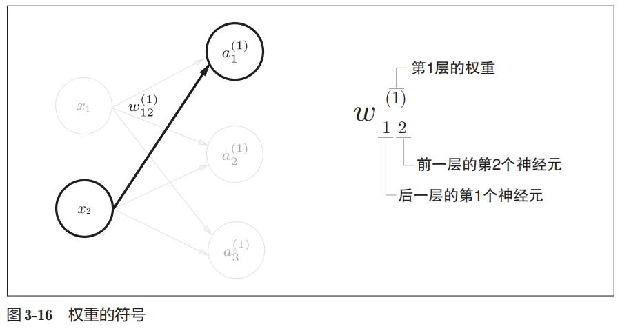

## 各层间信号传递的实现

观察第1层中激活函数的计算过程

- 增加了表示偏置的神经元“1”
- 隐藏层的加权和（加权信号和偏置的总和）用a表示
- 图中h ()表示激活函数
- 被激活函数转换后的信号用z表示

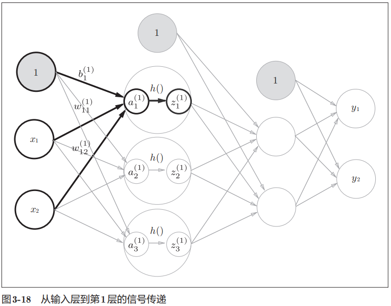

公式如下：
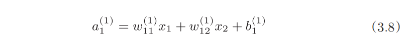

矩阵表示形式：
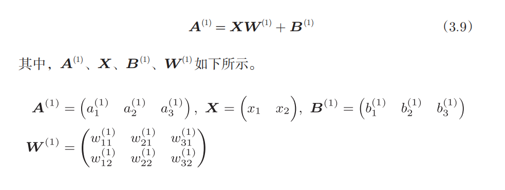

第1层到第2层的信号传递
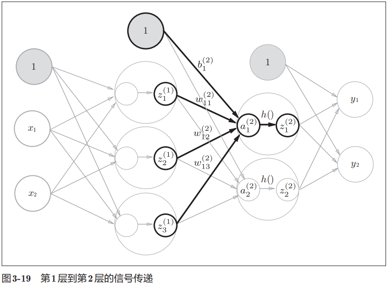

第2层到输出层的信号传递
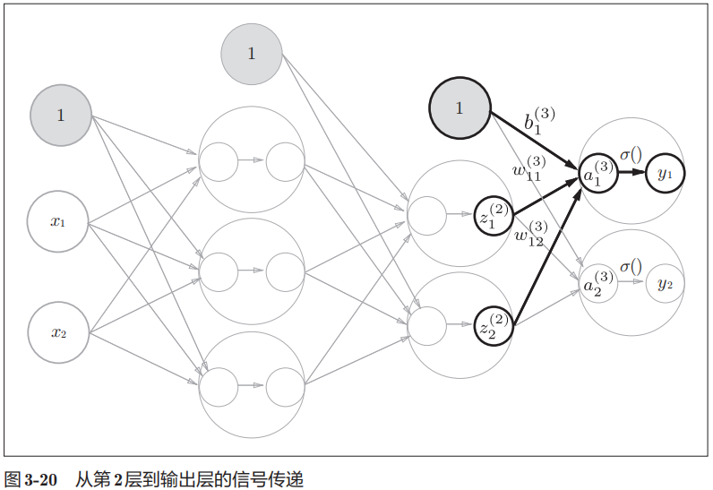

---

# 输出层设计

一般地，回归问题可以使用恒等函数，二元分类问题可以使用 sigmoid函数，多元分类问题可以使用 softmax函数

- 分类问题是数据属于哪一个类别的问题
    - 比如，区分图像中的人是男性还是女性的问题就是分类问题
- 回归问题是根据某个输入预测一个（连续的）数值的问题
    - 比如，根据一个人的图像预测这个人的体重的问题就是回归问题

## 恒等函数

恒等函数会将输入按原样输出，对于输入的信息，不加以任何改动地直接输出
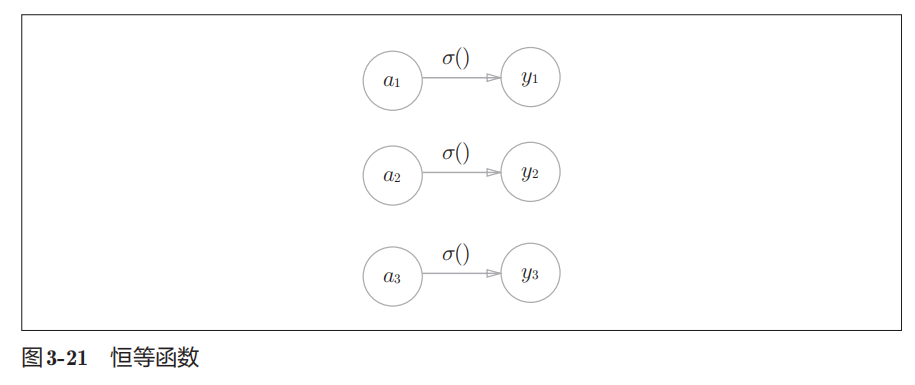

## softmax

### 公式

分类问题中使用的softmax函数
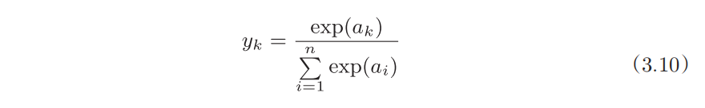

- exp (x)是表示e^x的指数函数（e是纳皮尔常数2.7182 ...）
- 分子是输入信号ak的指数函数
- 分母是所有输入信号的指数函数的和

<span style="color:red">**缺陷：e^x 过大，会导致溢出，改进如下**</span>
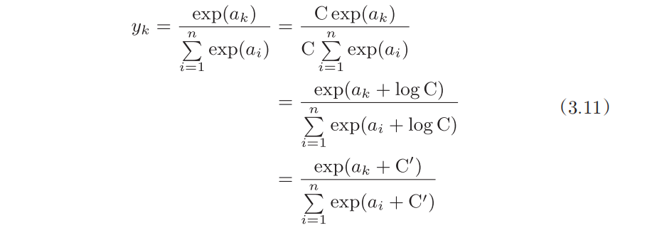

在进行softmax的指数函数的运算时，加上（或者减去） 某个常数并不会改变运算的结果

- 首先，在分子和分母上都乘上C这个任意的常数（因为同时对分母和分子乘以相同的常数，所以计算结果不变）
- 然后，把这个C移动到指数函数（exp）中，记为log C
- 最后，把log C替换为另一个符号C', 可以使用任何值，但是为了防止溢出，一般会使用输入信号中的最大值

### 特点

- softmax函数的输出是0.0到1.0之间的实数
- softmax函数的输出值的总和是1
- 我们可以把softmax函数的输出解释为“概率”

拓展： 求解机器学习问题的步骤可以分为<span style="color:red">**“学习” 和“推理”**</span>两个阶段

- 首先，在学习阶段进行模型的学习（指使用训练数据、自动调整参数的过程）
- 然后，在推理阶段，用学到的模型对未知的数据进行推理（分类）
    - 推理阶段一般会省略输出层的 softmax 函数

一般而言，神经网络只把输出值最大的神经元所对应的类别作为识别结果。
并且，即便使用softmax函数，输出值最大的神经元的位置也不会变。因此，神经网络在进行分类时，输出层的softmax函数可以省略

## 输出层神经元数量

输出层的神经元数量需要根据待解决的问题来决定。 对于分类问题，输出层的神经元数量一般设定为类别的数量

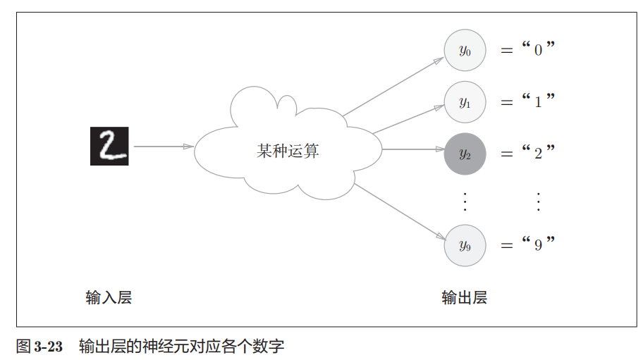

示例：

- 输出层的神经元从上往下依次对应数字0, 1, ..., 9
- 图中输出层的神经元的值用不同的灰度表示
- 以上例子中神经元y2 颜色最深，输出的值最大。这表明这个神经网络预测的是y2对应的类别，也就是“2”

---

# 案例（手写数字识别）

介绍完神经网络的结构之后，现在我们来试着解决实际问题。这里我们来进行手写数字图像的分类。

假设学习已经全部结束，我们使用学习到的参数，先实现神经网络的“推理处理”。这个推理处理也称为神经网络的 **前向传播（forward
propagation）**。

## 数据集

机器学习领域最经典的手写数字识别数据集 —— MNIST 数据集

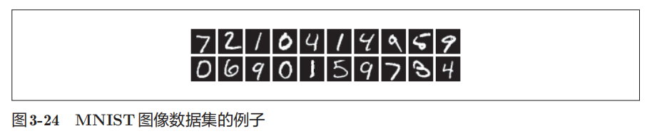

- MNIST数据集是由0到9的数字图像构成的
- 训练图像有【6万张】，测试图像有【1万张】，这些图像可以用于学习和推理
- MNIST数据集的一般使用方法是，先用训练图像进行学习，再用学习到的模型度量能在多大程度 上对测试图像进行正确的分类

| 文件名                           | 类型/格式         | 作用说明                                                               |
|:---------------------------------|:------------------|:-----------------------------------------------------------------------|
| **`train-images-idx3-ubyte.gz`** | 训练集-数据       | 包含 **60,000 张** 28 x 28 像素的手写数字灰度图片，用于训练模型。      |
| **`train-labels-idx1-ubyte.gz`** | 训练集-标签       | 包含上述 60,000 张训练图片对应的**正确数字答案**（0-9）。              |
| **`t10k-images-idx3-ubyte.gz`**  | 测试集-数据       | 包含 **10,000 张** 手写数字灰度图片，用于评估模型的泛化能力。          |
| **`t10k-labels-idx1-ubyte.gz`**  | 测试集-标签       | 包含上述 10,000 张测试图片对应的**正确数字答案**（0-9）。              |
| **`mnist.pkl`**                  | 数据缓存 (Pickle) | 解析后的数据快照。避免重复解压，供 Python 二次运行时**秒级加载**数据。 |
| **`mnist.py`**                   | Python 脚本       | 数据加载工具。用于解压并解析上述二进制 `.gz` 文件，将其转化为矩阵。    |

说明：

- Unsigned（无符号）：指该数据没有正负号，全部用来表示正整数（0 ~ 255）


- 对于图片文件：MNIST 的每张图片都是灰度图，每个像素点的亮度刚好用一个 ubyte 表示。0 代表纯黑色，255 代表纯白色，中间的数值代表不同深浅的灰色
- 对于标签文件：手写数字的答案是 0 到 9，用一个 ubyte（0~255）来存储完全绰绰有余

- idx 是 Index（索引） 的缩写，它代表一种非标准通用矩阵存储格式。后缀紧跟的数字（如 idx3 和 idx1），它们直接指明了数据的维度（Dimensions）
- idx3（三维矩阵 / 3D Array）
    - 应用于图片文件（train-images-idx3-ubyte）
    - 因为它存储的是一个三维的大魔方数据：[图片张数, 图片高度, 图片宽度]。
    - 具体到训练集就是：[60000, 28, 28]，即 60000 张 28 × 28 像素的图片
- idx1（一维向量 / 1D Vector）
    - 应用于标签文件（train-labels-idx1-ubyte）
    - 因为它存储的是一个简单的线型列表：[标签个数]。
    - 具体到训练集就是：[60000]，里面按顺序装了 60000 个数字答案。

## 神经网络推理处理

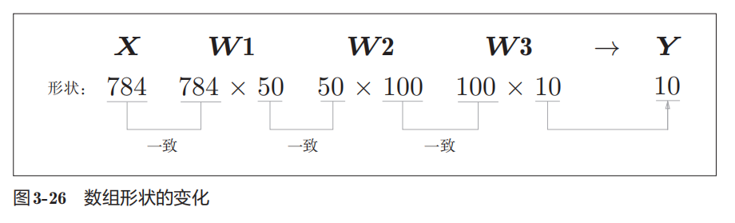

只输入一张图像数据时的处理流程:

- 输入一个由784个元素（原本是一 个28 × 28的二维数组）构成的一维数组后
- 输出一个有10个元素的一维数组。

具体步骤：

- 加载数据集
- 构建神经网络（可以加载已经训练好的参数）
- 前向传播（进行分类）
- 获取预测值
- 评估结果（比较预测结果和真实标签结果值）

## 批处理

现在我们来考虑打包输入多张图像的情形，这种打包式的输入数据称为 **批（batch）**

比如，我们想用predict ()函数一次性打包处理100张图像。 为此，可以把x的形状改为100 × 784，将100张图像打包作为输入数据

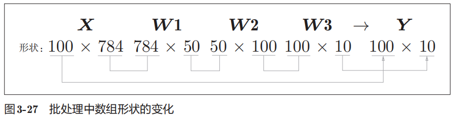

- 输入数据的形状为 100 × 784
- 输出数据的形状为100 × 10。这表示输入的100张图像的结果被一次性输出了

在神经网络的运算中，当数据传送成为瓶颈时，批处理可以减轻数据总线的负荷（严格地讲，相对于数据读入，可以将更多的时间用在计算上）。

<span style="color:red">**批处理可以明显提升神经网络的训练效率（提升几倍到几十倍）**</span>
批处理一次性计算大型数组要比分开逐步计算各个小型数组速度更快

